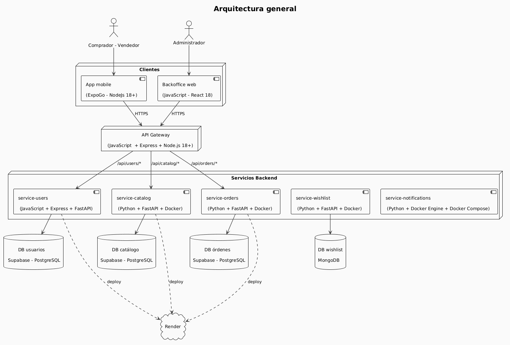

# Bazaar — Trabajo Práctico KanguShop

Bazaar es una plataforma de eCommerce desarrollada como trabajo práctico para la materia Ingeniería de Software II curso Rojas. La arquitectura está basada en microservicios independientes, cada uno con su propia base de datos y responsabilidad bien definida, comunicados a través de un API Gateway.

---

## Repositorios

### [service-catalog](https://github.com/bazaar-fiuba-2026/service-catalog)

Microservicio REST encargado del ciclo de vida de productos: creación, consulta, actualización y eliminación. Gestiona categorías, stock e imágenes de productos, e incluye un endpoint de recomendaciones por categoría y un historial de auditoría de cambios. Construido con **FastAPI** y **PostgreSQL**.

### [service-orders](https://github.com/bazaar-fiuba-2026/service-orders)

Service Orders es un microservicio backend para una plataforma de eCommerce. Se diseñó como una API REST encargada de manejar el carrito de compras y el ciclo de vida de las órdenes: creación, consulta y actualización.

### [service-users](https://github.com/bazaar-fiuba-2026/service-users)

Microservicio para la gestión de perfiles de usuario en Bazaar. La autenticación es gestionada por Supabase Auth. Este servicio se enfoca únicamente en: perfiles de usuario, dispositivos y PIN, administración y moderación. Los perfiles se crean automáticamente mediante un trigger en la base de datos cuando Supabase crea un nuevo usuario.

### [service-wishlist](https://github.com/bazaar-fiuba-2026/service-wishlist)

Microservicio REST que permite a los usuarios guardar y gestionar sus listas de deseos. Almacena únicamente IDs de productos (delegando los datos al service-catalog) y valida la identidad del usuario mediante el header `X-User-Id` inyectado por el API Gateway. Construido con **FastAPI** y **MongoDB**.

### [service-gateway](https://github.com/bazaar-fiuba-2026/api-gateway)

API Gateway es el punto de entrada único de la plataforma Bazaar. Se encarga de autenticar usuarios contra Supabase (email/password, OAuth de Google, login por PIN y refresh de sesión), verificar el JWT en cada request y resolver el rol y estado de aplicación consultando a service-users, rutear el tráfico hacia los microservicios internos (users, catalog, orders, wishlist, notifications), removiendo el prefijo y propagando headers de identidad y tracing y exponer rutas públicas para navegación anónima (catálogo, perfiles públicos, productos populares) y un health-check agregado del sistema.

### [service-notifications](https://github.com/bazaar-fiuba-2026/service-notifications)

Microservicio de notificaciones push de Bazaar. Se ocupa de avisarle cosas a los usuarios: por ejemplo, cuando cambia el estado de una compra, o cuando a un vendedor se le está por acabar el stock de un producto. Guarda los tokens de FCM de cada usuario (una persona puede tener varios dispositivos), manda las notificaciones push usando Firebase Cloud Messaging, deja registrada cada notificación en la base,
y evita mandar el mismo aviso de stock dos veces para el mismo producto.

### [app-backoffice](https://github.com/bazaar-fiuba-2026/app-backoffice)

Panel de administración del marketplace KanguShop. Soporta el estándar RFC 7807 para los errores HTTP que recibe del API gateway.

Cuando entrás como administrador, el sidebar de la izquierda te lleva a 4 vistas principales: usuarios, productos, orders y metricas.

### [app-mobile](https://github.com/bazaar-fiuba-2026/app-mobile)

Aplicación móvil de Bazaar, el marketplace donde cualquier persona puede comprar y vender productos de forma simple y segura. Entre las pantallas disponibles tenemos autenticacion, navegacion principal, perfil y configuracion, compras y ventas y publicaciones, entre otras.

### [auth-web](https://github.com/bazaar-fiuba-2026/auth-web)

Sitio web estático que actua como intermediario en la autenticacion para la app mobile. Entre sus principales responsabilidades se encuentran oauth callback, reset de contraseña, product deep links, el resultado de pagos y un health check. Es la landing page de auth que hace de puente entre los flujos web y la app  mobile nativa.

