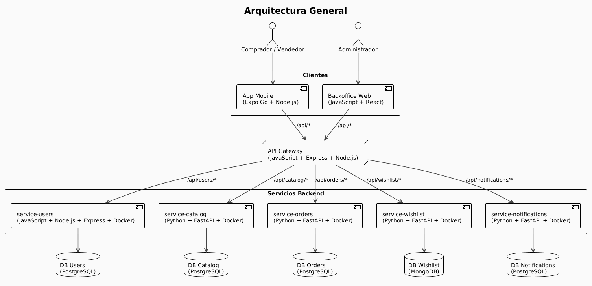

# Bazaar — Trabajo Práctico KanguShop

Bazaar es una plataforma de eCommerce desarrollada como trabajo práctico para la materia **Ingeniería de Software II** (Curso Rojas, FIUBA).

# Tabla de contenidos

- [Arquitectura](#arquitectura)
- [Repositorios](#repositorios)
  - [Backend](#backend)
  - [Frontend](#frontend)
- [Documentación del proyecto](#documentación-del-proyecto)
  - [Bitácora del proyecto](#bitácora-del-proyecto)
  - [Backlog inicial](#backlog-inicial)
  - [Historias de Usuario](#historias-de-usuario)
  - [Seguimiento interno](#seguimiento-interno)
  - [Presentaciones](#presentaciones)
- [Demos](#demos)

# Arquitectura

La solución está construida siguiendo una arquitectura de **microservicios**, donde cada servicio posee su propia base de datos y responsabilidad bien definida. Todos los componentes se comunican mediante un **API Gateway**.

# Repositorios

### Backend

### [service-catalog](https://github.com/bazaar-fiuba-2026/service-catalog)

Microservicio REST encargado del ciclo de vida de productos: creación, consulta, actualización y eliminación. Gestiona categorías, stock e imágenes de productos, e incluye un endpoint de recomendaciones por categoría y un historial de auditoría de cambios. Construido con FastAPI y PostgreSQL.

### [service-orders](https://github.com/bazaar-fiuba-2026/service-orders)

Service Orders es un microservicio backend para una plataforma de eCommerce. Se diseñó como una API REST encargada de manejar el carrito de compras y el ciclo de vida de las órdenes: creación, consulta y actualización.

### [service-users](https://github.com/bazaar-fiuba-2026/service-users)

Gestiona perfiles de usuario, dispositivos y PIN. La autenticación es delegada a Supabase Auth y los perfiles son creados automáticamente mediante triggers.

### [service-wishlist](https://github.com/bazaar-fiuba-2026/service-wishlist)

Permite administrar listas de deseos de los usuarios almacenando únicamente referencias a productos.

### [service-gateway](https://github.com/bazaar-fiuba-2026/api-gateway)

Punto único de entrada al sistema. Centraliza autenticación, autorización, routing, propagación de identidad y health checks.

### [service-notifications](https://github.com/bazaar-fiuba-2026/service-notifications)

Gestiona las notificaciones push mediante Firebase Cloud Messaging y mantiene el historial de envíos y tokens de dispositivos.

---

### Frontend

### [app-mobile](https://github.com/bazaar-fiuba-2026/app-mobile)

Aplicación móvil de Bazaar, el marketplace donde cualquier persona puede comprar y vender productos de forma simple y segura. Entre las pantallas disponibles tenemos autenticacion, navegacion principal, perfil y configuracion, compras y ventas y publicaciones, entre otras.

### [app-backoffice](https://github.com/bazaar-fiuba-2026/app-backoffice)

Panel administrativo utilizado para gestionar usuarios, productos, órdenes y métricas del sistema.

### [auth-web](https://github.com/bazaar-fiuba-2026/auth-web)

Aplicación web utilizada como intermediaria para los flujos de autenticación, recuperación de contraseña, OAuth y Deep Links.

# Documentación del proyecto

Durante el desarrollo del proyecto se mantuvo documentación actualizada para registrar el proceso de trabajo, realizar el seguimiento de las tareas y documentar las decisiones tomadas en cada etapa.

## Bitácora del proyecto

Se realizó un seguimiento semanal del avance del proyecto, documentando los objetivos alcanzados, funcionalidades implementadas y planificación de cada checkpoint.

> La bitácora puede consultarse en los documentos de seguimiento correspondientes a cada entrega.

## Backlog inicial

El backlog inicial permitió organizar y priorizar las funcionalidades del producto antes del comienzo del desarrollo.

 [GitHub Project](https://github.com/orgs/bazaar-fiuba-2026/projects/1)

## Historias de Usuario

Las historias de usuario fueron refinándose a medida que avanzó el proyecto.

- Checkpoint 2:   [Documento CH2](https://docs.google.com/document/d/1VkiupEak8zu1-pSQkEfZrfi9cjOBwl-6CMn6kS3rHKk/edit?usp=drive_link)

- Checkpoint 3: [Documento CH3](https://docs.google.com/document/d/1fPZauXmuLLpjU9D-C0DlZAoe4hfx2W5-ip7Hg6jJXQg/edit?usp=drive_link)

## Seguimiento interno

Como complemento del backlog, el equipo llevó un documento interno donde se controló los avances, tareas pendientes y decisiones de desarrollo.

 [Documento](https://docs.google.com/document/d/1Mx2_lwr_fSbq0ZpVSsV3Wb0rONhPUSgbuV-e1nEcgFI/edit?usp=drive_link)

## Presentaciones

Las presentaciones utilizadas durante las exposiciones de los distintos checkpoints se encuentran disponibles en Canva.

- Checkpoint 1 y Checkpoint 2: [Presentación](https://canva.link/pfvpwla4u2y3v44)

# Demos

Para las demos realizadas en cada uno de los checkpoints que se llevaron a cabo a lo largo del cuatrimestre, se utilizó el site https://cron-job.org/ para schedulear un cron job cada n minutos y que todos 
los servicios de este trabajo se mantengan "vivos" en el sitio en donde se encuentran deployados (en particular nosotros elegimos render, el cual permanece activo mientras reciba requests en un rango de 15 minutos).
